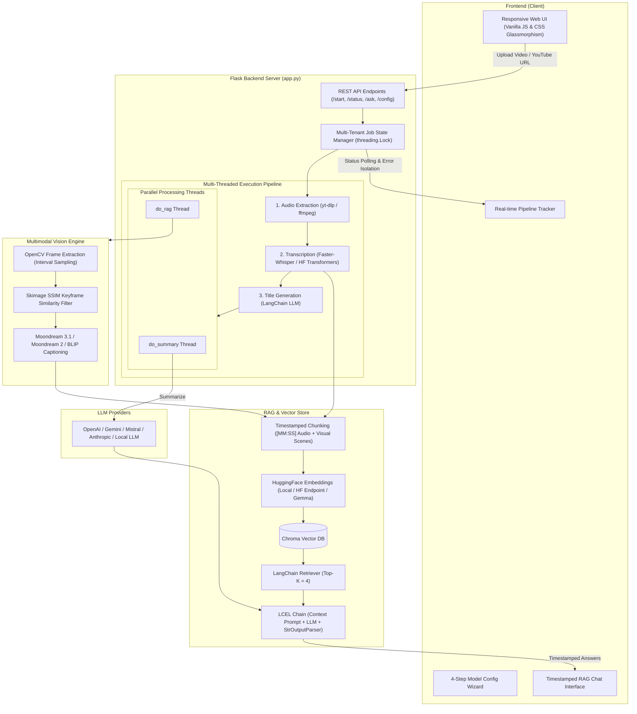

# 🎥 AIVA – AI Video Assistant (Multimodal Video RAG Agent)

[](https://www.python.org/)
[](https://flask.palletsprojects.com/)
[](https://www.langchain.com/)
[](https://www.trychroma.com/)
[](https://opensource.org/licenses/MIT)

**AIVA (AI Video Assistant)** is an advanced, full-stack **Multimodal Video Processing & RAG (Retrieval-Augmented Generation)** application. It ingests local video/audio files or YouTube URLs, automatically generates intelligent summaries, titles, and action items, and indexes **both spoken audio and visual keyframe scenes** into a Chroma Vector Database.

Users can interactively query the video and receive precise, **timestamped citations (`[MM:SS]`)** referencing both what was spoken and what appeared on screen.

---

## 🏗️ System Architecture Diagram



---

## ✨ Key Features

- **Multimodal Video RAG:** Combines speech-to-text transcripts with visual scene keyframe captions so users can ask questions about spoken topics OR visual objects on screen.
- **Smart Timestamped Chunking:** Segments transcript into ~120-word windows tagged with `[MM:SS]` start/end bounds for exact source citation.
- **Dual Compute Architecture (Offline & Online):**
  - **Offline (Edge Compute):** Run transcription (`faster-whisper`), vision captioning (`Moondream2`, `BLIP`), and vector embeddings locally for 100% privacy and zero API costs.
  - **Online (Cloud Inference):** Offload heavy computation to Hugging Face Inference endpoints and cloud LLM providers.
- **Gated Model Support:** Integrated support for Hugging Face authentication tokens to load gated models like `google/embeddinggemma-300m`.
- **Fault-Tolerant Pipeline:** Multi-threaded backend with per-step `try-except` isolation. If a step fails, execution halts cleanly and reports the exact failure step directly in the UI.
- **YouTube Bot-Protection Bypass:** Automated cookie retrieval using `browser_cookie3` to bypass strict YouTube `yt_dlp` bot throttling.
- **Provider Agnostic:** Swap dynamically between OpenAI, Google Gemini, Mistral AI, and Anthropic.

---

## 🛠️ Tech Stack & Libraries

| Component | Technologies Used |
| :--- | :--- |
| **Backend Core** | Python 3.10-3.12, Flask, Flask-CORS, Multi-threading |
| **AI / Orchestration** | LangChain Expression Language (LCEL), LangChain Core |
| **Vector DB** | Chroma DB (`langchain-chroma`) |
| **Speech-to-Text** | `faster-whisper`, HuggingFace Transformers Whisper |
| **Computer Vision** | OpenCV (`cv2`), `scikit-image` (SSIM metric), PIL, Moondream 2/3, BLIP |
| **Embeddings** | HuggingFace Embeddings, SentenceTransformers, EmbeddingGemma |
| **Media Extraction** | `yt-dlp`, `pydub`, `ffmpeg`, `browser_cookie3` |
| **Frontend UI** | HTML5, Modern CSS Glassmorphic design, Vanilla JavaScript (ES6+) |

---

## 🚀 Quick Start & Installation

### Prerequisites

1. **Python 3.10, 3.11, or 3.12** *(Python 3.13+ is not supported due to the removal of standard `audioop`).*
2. **FFmpeg** installed and added to your System Environment PATH.
3. (Optional) Chrome or Edge browser installed for automated YouTube cookie extraction.

### Setup Instructions

1. **Clone the repository:**
   ```bash
   git clone https://github.com/shreyash729/Video-Agent.git
   cd video-agent
   ```

2. **Create and activate a Python virtual environment:**
   ```bash
   python -m venv .venv
   
   # Windows (PowerShell):
   .\.venv\Scripts\activate
   
   # Mac / Linux:
   source .venv/bin/activate
   ```

3. **Install dependencies:**
   ```bash
   # Base dependencies (Required):
   pip install -r requirements.txt

   # (Optional) Local offline model compute dependencies:
   pip install -r requirements_local.txt

   
4. **Environment Variables (Optional `.env`):**
   Create a `.env` file in the root folder:
   ```env
   ALLOW_LOCAL_MODEL="true"
   GITHUB_REPO="https://github.com/shreyash729/Video-Agent.git"
   ```

5. **Run the Application:**
   ```bash
   python app.py
   ```
   Open your browser and navigate to **`http://localhost:5000`**.

---

## ⚙️ Model Configuration Guide

When opening the app for the first time, click **Configuration** to complete the 4-step wizard:

1. **Step 1: LLM Setup** – Choose your model provider (e.g. Google GenAI, OpenAI) and enter your API Key.
2. **Step 2: Transcription** – Select Offline (`faster-whisper`) or Online (HuggingFace Inference).
3. **Step 3: Embeddings** – Choose your embedding model (`all-MiniLM-L6-v2`, `embeddinggemma-300m`). Provide a HuggingFace Token if using gated models.
4. **Step 4: Vision Engine** – Toggle Vision processing on/off and select your preferred vision model (`BLIP`, `Moondream 2`, `Moondream 3.1`).

---

## 📜 License

This project is open source and available under the [MIT License](LICENSE).
